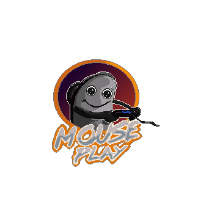

<p align="center">

</p>

# mouseplay
[](LICENSE)
[](https://discord.gg/afsEtMR)

mouseplay enables you to use a regular mouse & keyboard with the PS Remote Play Tool. The mouse and keyboard buttons are being translated to controller inputs.

## This project is still work-in-progress and does not yet have a release version.

### Mapping files

Mapping files are simple plain JSon files. You can find example mappings in the `mappings` subfolder.

### Building it yourself
Make sure to install rust (preferably via https://rustup.rs) and the Microsoft Compiler (via Visual Studio).

It is important to compile the project for a 32bit target (as PS Remote Play in itself is also just a 32bit program). To do this with rustup just run:
```
rustup target add i686-pc-windows-msvc
```

To compile the project you can just run
```
cargo build --target=i686-pc-windows-msvc --release
```
or execute the provided `build.bat` file.

### Known limitations

- Controller spoofing is not yet implemented so you have to connect a PlayStation controller to the PC.
- Mouse cursor and toolbar is not hidden when mouse lock is active
- Not all cases of window transitions (windows opening and closing) are handled well yet

### Demo

[](http://www.youtube.com/watch?v=0QhSsvRO_Y8 "mouseplay demo")

## License

Licensed under GPL-3.0 License, see [LICENSE](LICENSE).

### Contribution

Unless you explicitly state otherwise, any contribution intentionally submitted for inclusion in the work by you, shall be licensed as above, without any additional terms or conditions.
